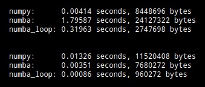

# Profiling Numpy and Numba code

The module in this repository compares execution time and maximum memory usage for different methods of converting a color image to black-and-white.

The conversion methods are:  

- using Numpy  
- using Numba to *jit* the Numpy method  
- using a *for* loop in Numba  

This project is derived from and replicates the results from Itamar Turner-Trauring's blog post [The wrong way to speed up your code with Numba](https://pythonspeed.com/articles/slow-numba/).  For a more thorough and detailed explanation, please see his [post](https://pythonspeed.com/articles/slow-numba/).

## Results

The execution times and maximum memory usage of the conversion methods are below.  The results from a first run of all three methods are printed on the first three lines; the second set of three lines shows results for the second run with a different color image as input.  [The second run shows the optimized execution times.](https://numba.readthedocs.io/en/stable/user/5minguide.html)  Please note that the exact execution times will stochastically vary from run to run, though the maximum memory usage should be consistent for a given image.



The results from the second run above replicate the primary theme of [Mr. Turner-Trauring's blog post](https://pythonspeed.com/articles/slow-numba/):  trying to optimize the Numpy code by merely *jitting* it with Numba is far inferior to rewriting the code with a *for* loop to take advantage of how Numba optimizes code.  The *for* loop Numba code is much faster than the *jitted* written-for-Numpy code, and it requires much less memory.

Note that if one wants a more careful quantification of the code speed-up and reduced memory usage, one should statistically summarize results from multiple profiling runs on images that are representative of the ones that will be encountered in production.


## Run with Anaconda

From the top-level project directory, you can create and activate the Anaconda environment by [running these commands](https://docs.conda.io/projects/conda/en/latest/user-guide/tasks/manage-environments.html):

```code
conda env create -f environment.yml

conda activate numba01
```

Then you can run the code and save the results with this command:

```code
python src/convert_bw.py > output/profiling_results.txt
```
